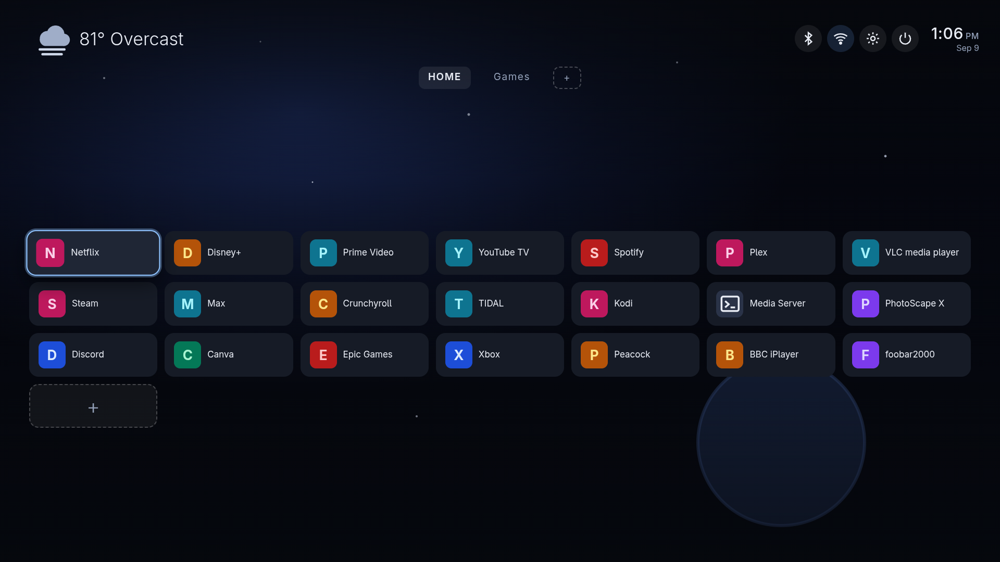
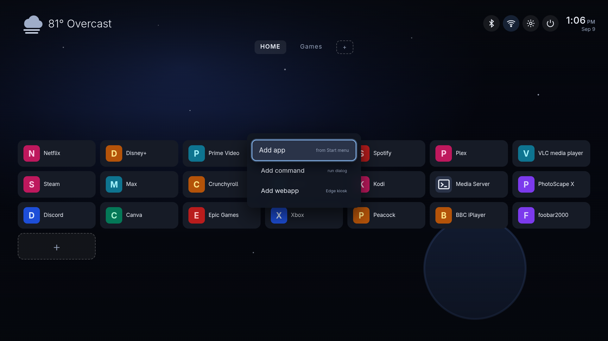
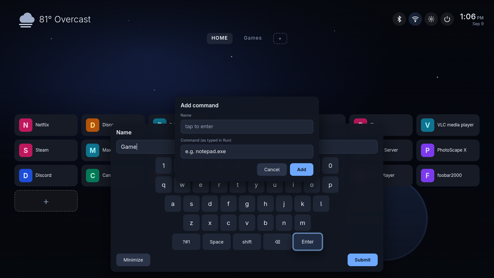
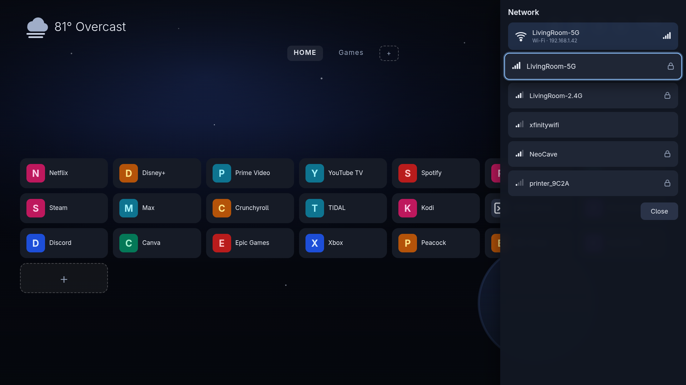
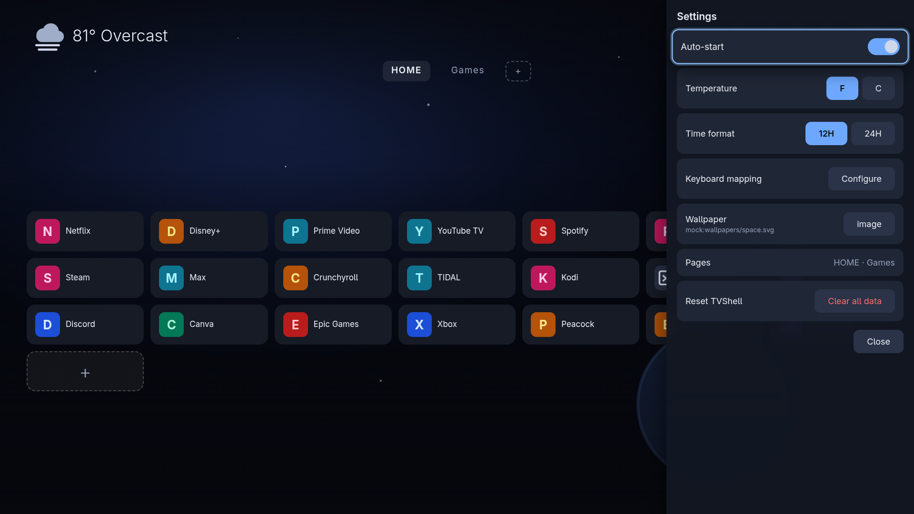
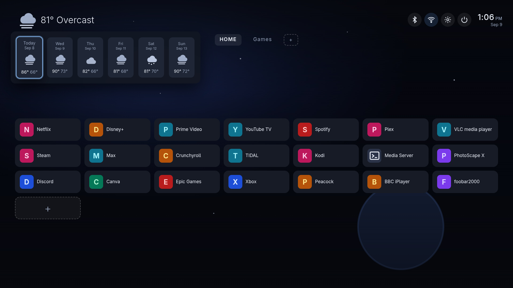
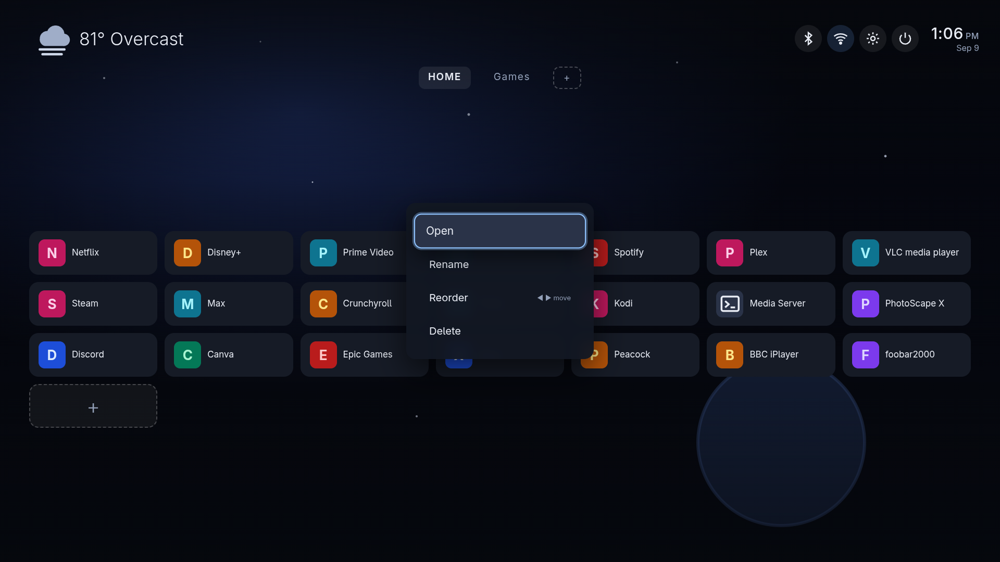

# HTLauncher

A Google TV–style experience for Windows. Install it on a PC hooked up to your living-room TV and you get a fullscreen, dark-mode, 10-foot interface driven entirely by a remote control (any IR/Bluetooth remote that sends standard keys — or an Air Mouse). No mouse, no keyboard, no desktop in sight.

Point it at Netflix, Prime, Plex, whatever lives in your Start Menu — or any website as a fullscreen "webapp" — and launch everything from one tidy grid, like a real smart TV.



## What it does

- **Fullscreen TV home screen** — no window chrome, no taskbar; optimized for a 65" screen at 720p/1080p/4K with large, remote-friendly targets
- **Everything from the remote** — spatial D-pad navigation, on-screen keyboard, menus, pages. The physical mouse/keyboard are never required
- **Built-in YouTube TV** — a first-class, fullscreen YouTube experience (PS4 Leanback user agent for 4K60 + audio dub support, remote-first input handling, Back returns to the launcher). Always available in the Add-app list as "YouTube TV"
- **Tiles for anything**:
  - *Apps* — any program from your Windows Start Menu, with its real icon
  - *Webapps* — any URL, opened in Edge kiosk mode, favicon pulled automatically
  - *Commands* — anything you could type into `Win+R` (map drives, wake devices, launch scripts)
- **Pages** — up to 3 extra tile pages beyond HOME (Kids, Games, …), flipped with Page Up / Page Down
- **Weather** — current conditions + 5-day forecast (Open-Meteo, no API key) top-left; tap it for the popup
- **Bluetooth panel** — radio toggle, see what's connected, connect/disconnect paired devices
- **Wi-Fi panel** — status with signal bars, scan networks, connect with the on-screen keyboard
- **Settings** — auto-start on login, temperature (°F/°C), time format (12H/24H), wallpaper (single image or random rotation from a folder with adjustable interval), and a key-remapping screen for every remote button
- **Power menu** — Sleep / Shut down the PC / Exit
- **Volume guard** — on every load it checks system volume is at 100% and unmuted (the remote controls volume; the app never fights it)
- **Daily auto-updates** — checks GitHub Releases, downloads, and reinstalls itself

## Remote control buttons

| Remote button | Keyboard equivalent | Action |
|---|---|---|
| D-pad | Arrow keys | Move selection |
| OK / Select | Enter | Activate |
| Back | Delete (or Esc) | Close current panel / menu |
| Home | Home key | Jump back to the home screen from anywhere |
| Menu / ⋮ / Cog | End key | Context menu (add tile, tile options) |
| Page +/- | Page Up / Page Down | Switch tile pages |
| — | Alt+S | Put the PC to sleep |

Every mapping is editable in **Settings → Keyboard mapping** — press a button, hit the key you actually have.

## Screens

**Add anything with the + tile** — apps, commands, or webapps:



**On-screen keyboard** — letters, symbols, shift, backspace, enter, minimize, and submit. Name-required fields guide you; nothing needs a physical keyboard:



**Wi-Fi panel** — signal bars, connection info, and password entry on the remote:



**Settings** — the essentials, all remote-navigable:



**Weather popup** and **tile context menu** (rename / reorder / edit / delete, per-tile):




## Installing

1. Download the latest `HTLauncher-Setup-x.y.z.exe` from [Releases](https://github.com/ct06033/HTLauncher/releases).
2. Run it. It's one-click, installs machine-wide, and launches HTLauncher when it finishes.
3. Recommended for a true appliance feel:
   - Enable Windows auto-login (`netplwiz`) so a reboot lands you straight in the launcher
   - Turn off the screensaver / display sleep from Windows (let the remote do it)

## Using it

- Launch into the grid with the D-pad, press **OK** to open something
- **Menu** on the **+** tile adds apps / commands / webapps; new items go to the front of the list
- **Menu** on any tile renames, reorders (live ◀ ▶), edits, or deletes it
- Top bar: **Bluetooth**, **Wi-Fi**, **Settings**, **Power**, plus the clock and tappable weather
- **Home** always pulls you out of any panel/menu back to the grid, even after a fullscreen app misbehaves

## How to exit to the Windows desktop

HTLauncher never shows the desktop while you're using it — closed programs return here, not to Explorer. When you *do* want the desktop (maintenance, installing things, etc.):

1. Press the **Power** icon in the top bar (or navigate to it and press OK)
2. Choose **Exit program**
3. Confirm — HTLauncher closes and you're at the normal Windows desktop

Alternative if the app is ever unresponsive: `Alt+Tab` out of it or `Ctrl+Shift+Esc` → end task (it's a normal Electron app, not a locked shell). Rebooting relaunches it automatically if auto-start is on.

Uninstalling: Settings → Apps → HTLauncher → Uninstall. Your tile/page settings are left untouched under `%APPDATA%` if you ever come back.

## Building from source

```bash
git clone https://github.com/ct06033/HTLauncher
cd HTLauncher
npm install
npm start                 # run unpackaged (dev)
npm run dist              # build the NSIS installer (Windows, or Linux w/ wine)
```

The UI layer (`web/`) runs in a plain browser against a mock backend (`python -m http.server` in `web/`) — the same code runs fullscreen inside Electron against real Windows services on the other side of a thin IPC bridge. See `docs/` for the build notes.

## Requirements

- Windows 10/11 x64
- Any remote that emits standard keyboard codes (most IR remotes via a USB receiver, Bluetooth Air Mice, the Xbox accessories remote, etc.)
- Microsoft Edge (ships with Windows 11) for webapps

## Credits

- Built-in YouTube TV view adapted from [Liams-Electronics-Lab/HTPC-YT](https://github.com/Liams-Electronics-Lab/HTPC-YT) (GPL-3.0) — thanks for the Leanback user-agent and remote-input handling groundwork
- Vibecoded with **Qwen 3.8 Flash** 🤖 — this is my first project, so be kind, and open to PRs.

## License

GPL-3.0-only (see LICENSE)
